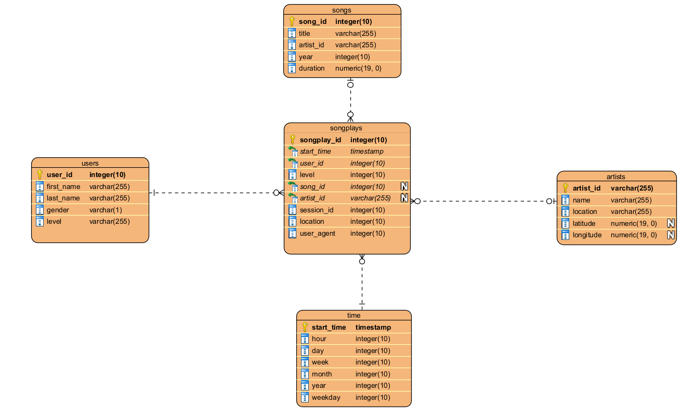

# Data Modeling with Postgre

This project the follow along this medium <a href="https://medium.com/@simonazhangzy/data-modeling-awith-postgres-database-43fd7c33d93b">blog</a>

# Introduction

The music streaming startup Sparkify wants to analyze the data they’ve been collecting on songs and user activity on their new music streaming app. The analytics team is particularly interested in understanding what songs users are listening to. Currently, they don’t have an easy way to query their data, which resides in a directory of JSON logs on user activity on the app, as well as a directory with JSON metadata on the songs in their app.

# Accomplishments

Model data with Postgres Database.

Build an ETL pipeline using Python.

On the database side, I defined fact and dimension tables for a Star Schema for a specific focus. On the other hand, the ETL pipeline would transfer data from files located in two local directories into these tables in Postgres using Python and SQL.

